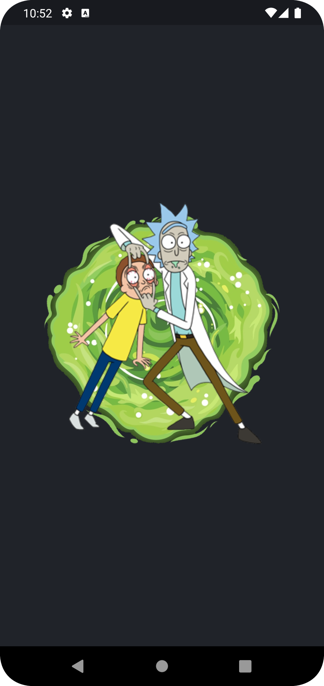
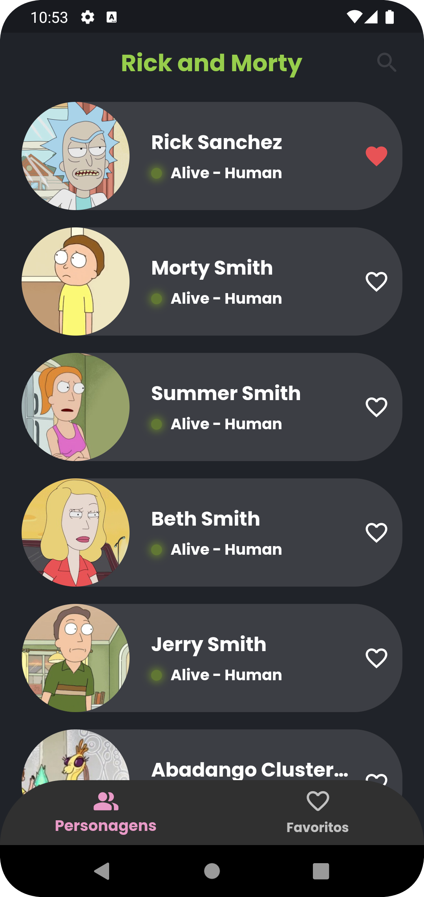
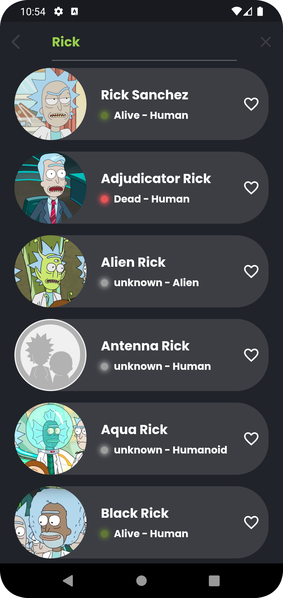
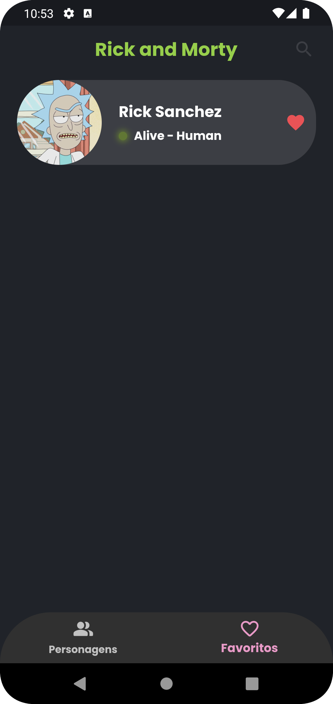
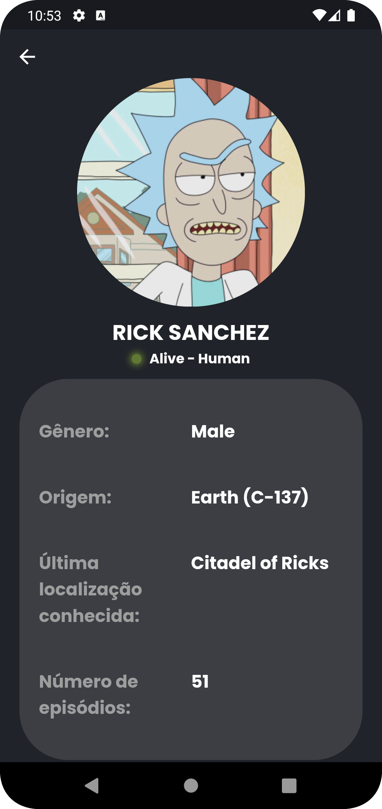

## Sobre o projeto

O Aplicativo utiliza a API [The Rick and Morty API
](https://rickandmortyapi.com) para recuperar dados e fornecer uma lista de personagens juntamente com suas informações.

## Demonstração

### Tecnologias utilizadas

- Flutter para o desenvolvimento do aplicativo móvel
- Utilização da API de The Rick and Morty para acessar dados dos personagens
- Bloc para gerenciamento de estado e lógica de negócios
- Cached Network Image para o carregamento eficiente e o cache de imagens da rede

## Funcionalidades

- Visualização de uma lista de personagens
- Acesso aos detalhes de cada personagem
- Marcação e visualização de personagens favoritos
- Pesquisa abrangente por todos os personagens

## Documentação

[Documentação](https://rickandmortyapi.com/documentation)

## 🔗 Links

